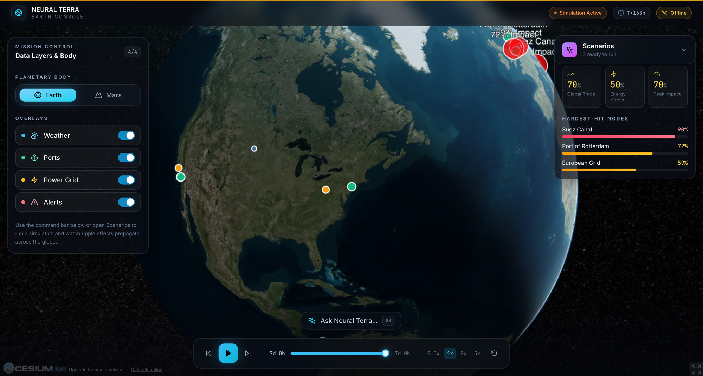

<div align="center">

# Neural Terra
## The Living Simulation of Earth

[](https://github.com/zaydabash/neural-terra/actions)
[](https://opensource.org/licenses/MIT)
[](https://www.python.org/downloads/)
[](https://nodejs.org/)

An interactive digital twin of Earth for simulating events, predicting ripple effects, and visualizing planetary systems.

[Live Demo](https://neural-terra-8fjvtnrm0-zs-projects-f6d2059b.vercel.app)



</div>

## What It Is

Neural Terra renders an interactive 3D globe (CesiumJS) and lets you run "what if" scenarios against a graph of world infrastructure. A shock to one node (a canal, a port, a power grid) propagates through the network so you can watch the downstream impact unfold over time. You can drive it with the scenario buttons or type a plain question into the command bar.

It also ships a Mars console: a Martian globe with colonies, life support, and a launch pad, plus two Mars scenarios.

## Current Status

This is a working prototype, not a production digital twin. Here is the honest picture of what runs today.

* **Frontend**: Next.js app with an interactive CesiumJS globe, a scenario drawer, a timeline scrubber, and a natural language command bar.
* **Backend**: FastAPI service with a graph based ripple engine, data agents (ports, grid, weather, alerts), and `/simulate` plus `/nl/run` endpoints.
* **Scenarios**: A set of Earth scenarios (Suez disruption, EU heatwave, LA port shutdown) and Mars scenarios (oxygen grid failure, launch pad delay), all wired to the ripple engine.
* **Data**: Uses bundled snapshot JSON by default. The weather agent can call Open Meteo for live data when offline snapshots are turned off.
* **Simulation**: A rule based ripple engine with structured but synthetic dynamics. It is not calibrated to real world forecasts or operational decision making.

## Scenarios

* **Suez Disruption** `Simulate 40% slowdown in Suez Canal for 7 days`. Global shipping impact.
* **EU Heatwave** `What happens if Europe heats up 3C?`. Grid stress cascade.
* **LA Port Shutdown** `Complete LA port closure for 24 hours`. Trans Pacific disruption.
* **Mars Oxygen Failure** `Simulate 50% oxygen failure at Colony Alpha`. Life support cascade.
* **Mars Launch Delay** `Launch pad maintenance delay for 12 hours`. Supply chain disruption.

## Quick Start

```bash
# Clone the repository
git clone https://github.com/zaydabash/neural-terra.git
cd neural-terra

# Backend (FastAPI ripple engine)
cd apps/backend
pip install -r requirements.txt
uvicorn main:app --reload --port 8000

# Frontend (Next.js), in a second terminal
cd apps/frontend
npm install
export NEXT_PUBLIC_API_URL=http://localhost:8000
npm run dev

# Open http://localhost:3000
```

Quick demo:

1. Toggle the Weather, Ports, and Grid overlays to see nodes on the globe.
2. Open Scenarios and run Suez Canal Disruption.
3. Watch the impact bars fill and the affected nodes light up on the globe.
4. Switch to Mars and run Oxygen Grid Failure.
5. Press Cmd+K and type a question, for example "Simulate 50% oxygen failure at Colony Alpha".

## API Quickstart

```bash
# Health check
curl http://localhost:8000/healthz

# Current weather layer
curl http://localhost:8000/layers/weather

# Run a simulation
curl -X POST http://localhost:8000/simulate \
  -H "Content-Type: application/json" \
  -d '{"target_ids": ["suez_canal"], "magnitude": 0.4, "duration_hours": 168}'

# Natural language query
curl -X POST http://localhost:8000/nl/run \
  -H "Content-Type: application/json" \
  -d '{"text": "What happens if LA port shuts down for 24 hours?"}'
```

## Architecture

* **Frontend** (Next.js): CesiumJS globe, Zustand store, Tailwind CSS, TypeScript.
* **Backend** (FastAPI): data agents, the NetworkX ripple engine, and a natural language engine.
* **Data**: bundled snapshot JSON, with an optional live weather source.

The frontend talks to the backend through Next route handlers under `app/api`. When no backend is reachable, the globe and scenarios fall back to bundled offline data so the demo still runs.

## Mars Console

Switch the planet toggle to Mars and the globe swaps to a Martian surface (NASA Trek imagery, with a rust colored base as a fallback). Mars has its own node graph (colonies, oxygen grid, water plant, launch pad) and two scenarios:

* `Simulate 50% oxygen failure at Colony Alpha`, a life support cascade.
* `Launch pad maintenance delay for 12 hours`, a supply chain disruption.

Full terraforming (atmosphere, water cycle, ecosystem design) is on the roadmap, not implemented yet.

## Development

```bash
make dev             # full stack via docker compose
make test            # backend pytest + frontend lint
make check-snapshots # snapshot integrity
make smoke-test      # backend smoke test
make e2e-test        # Playwright end to end
make analyze         # frontend bundle analysis
make ci              # full local pipeline
```

## Performance and Quality

These are targets and what is verified today. They are not yet enforced as hard CI gates, so treat the numbers as goals.

* **Bundle size**: about 100 kB of initial JavaScript for the main route. Cesium assets load separately. Not gate enforced in CI.
* **Load time and frame rate**: targets of under 2s load and roughly 60fps on a base M chip. Measured by hand, not tracked in CI.
* **Tests**: backend pytest and a Playwright run on every push via GitHub Actions. Coverage reports are not generated yet.
* **Builds**: `next build` and `tsc --noEmit` both pass clean.

Roadmap: wire bundle budgets, Lighthouse, and coverage thresholds into CI so these become enforced gates.

## Security

* **No committed secrets**: `.env*` is gitignored and the repo ships only `*.env.example` templates. Verified clean.
* **CORS allowlist**: the backend restricts origins to `CORS_ORIGIN` (default `http://localhost:3000`).
* **Opt in telemetry**: off by default, enabled only when `NEXT_PUBLIC_TELEMETRY=1`.

Not implemented yet (roadmap): HTTP security headers, dependency scanning in CI, and authentication. This is a local preview, not a hardened production deployment.

## Known Limitations

* Scenarios use simplified rules and are not calibrated to real world data.
* Live data streams are off by default; bundled snapshots are used.
* No authentication. Intended for local preview and demo.

## License

MIT. See the [LICENSE](LICENSE) file.

## Acknowledgments

CesiumJS for the globe, FastAPI for the backend, NetworkX for the graph engine, and NASA Trek for the Mars imagery.
