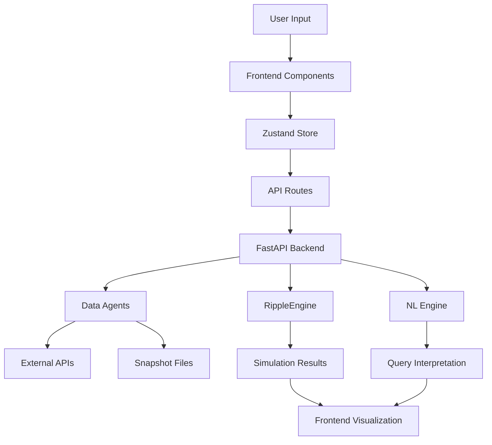

# Neural Terra Architecture

## Overview

Neural Terra is a real-time, AI-powered digital twin of Earth that simulates global systems and their interdependencies. The system consists of a FastAPI backend for data processing and simulation, and a Next.js frontend with a CesiumJS 3D globe for visualization.

## System Architecture

```
┌─────────────────┐    ┌─────────────────┐    ┌─────────────────┐
│   Frontend      │    │    Backend      │    │   Data Sources  │
│   (Next.js)     │◄──►│   (FastAPI)     │◄──►│   (APIs/Files)  │
│                 │    │                 │    │                 │
│ • CesiumJS      │    │ • Data Agents   │    │ • Weather APIs  │
│ • Zustand       │    │ • RippleEngine  │    │ • Port Data     │
│ • TailwindCSS   │    │ • NL Engine     │    │ • Grid Data     │
│ • TypeScript    │    │ • NetworkX      │    │ • Alert Feeds   │
└─────────────────┘    └─────────────────┘    └─────────────────┘
```

## Backend Architecture

### Data Agents
- **WeatherAgent**: Fetches temperature and weather data
- **PortsAgent**: Manages major shipping port information
- **GridAgent**: Handles power grid status and stress levels
- **AlertsAgent**: Processes system alerts and warnings

Each agent implements:
- Live data fetching with API fallbacks
- Offline snapshot loading
- Data normalization to standard schemas
- Caching with TTL

### Simulation Engine (RippleEngine)
- **Graph Structure**: NetworkX-based directed graph
- **Node Types**: Regions (continents) and Assets (ports, grids)
- **Edge Properties**: Weight, delay, decay parameters
- **Propagation**: Time-series impact calculation with ripple effects

### Natural Language Interface
- **Rule-based Parser**: Extracts targets, magnitude, duration
- **Asset Aliases**: Maps natural language to system IDs
- **Scenario Generation**: Converts queries to simulation parameters

## Frontend Architecture

### State Management (Zustand)
- **Layer State**: Weather, ports, grid, alerts visibility
- **Simulation State**: Current time, playback, scenario data
- **Viewer State**: Cesium viewer instance and camera

### Components
- **GlobeViewer**: CesiumJS 3D globe with atmospheric effects
- **ControlPanel**: Layer toggles and playback controls
- **ScenarioDrawer**: Canned scenario selection
- **NLCommandBar**: Natural language query interface
- **Timeline**: Simulation playback and scrubbing

### Data Flow
1. User interacts with UI components
2. Zustand store updates state
3. API routes proxy requests to backend
4. Backend processes data and runs simulations
5. Results flow back to frontend for visualization

## Data Flow Diagram



## Key Features

### Real-time Data Processing
- Multi-source data ingestion
- Offline fallback guarantees
- Caching with configurable TTL
- Error handling and recovery

### Simulation Capabilities
- Graph-based ripple effect modeling
- Configurable propagation parameters
- Time-series impact tracking
- Scenario persistence and replay

### Natural Language Interface
- Intent parsing and extraction
- Asset and region mapping
- Confidence scoring
- Extensible grammar rules

### Visualization
- Cinematic 3D globe with atmospheric effects
- Dynamic layer rendering
- Real-time animation
- Interactive timeline scrubbing

## Deployment

### Docker Compose
- Backend: Python 3.11 with FastAPI
- Frontend: Node.js 18 with Next.js
- Health checks and dependency management
- Environment-based configuration

### CI/CD Pipeline
- Automated testing with pytest and Jest
- Linting with ruff and ESLint
- Type checking with mypy and TypeScript
- Docker image building and testing

## Scalability Considerations

### Backend
- Stateless design for horizontal scaling
- Database integration ready (PostgreSQL/MongoDB)
- Redis caching for production
- Async processing for long simulations

### Frontend
- Static generation for performance
- CDN deployment ready
- Progressive enhancement
- Mobile-responsive design

## Security

### API Security
- CORS configuration
- Input validation with Pydantic
- Rate limiting ready
- Authentication hooks

### Data Privacy
- No personal data collection
- Public data sources only
- Configurable data retention
- GDPR compliance ready

## Monitoring

### Health Checks
- Backend: `/healthz` endpoint
- Frontend: Built-in Next.js health
- Docker: Container health checks
- CI: Automated testing

### Logging
- Structured logging with context
- Error tracking and reporting
- Performance metrics
- Debug mode support

## Future Enhancements

### Data Sources
- Real-time satellite feeds
- IoT sensor integration
- Social media sentiment
- Economic indicators

### Simulation
- Machine learning models
- Higher resolution graphs
- Multi-scale modeling
- Collaborative scenarios

### Visualization
- VR/AR support
- Mobile applications
- Export capabilities
- Custom themes

### AI Integration
- LLM-powered natural language
- Predictive modeling
- Anomaly detection
- Automated insights
